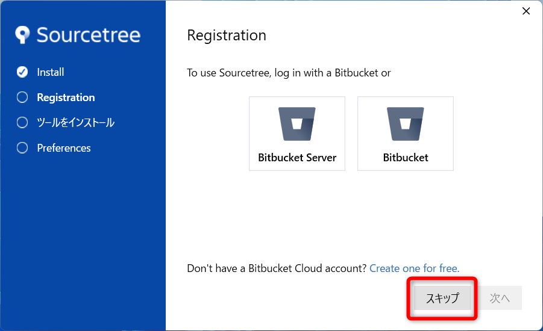

# Sourcetree

## インストールの手順

### ダウンロード

下記サイトからSourcetreeをダウンロードする  
https://www.sourcetreeapp.com/

`I agree...`にチェックを入れて、`Download`をクリック  

`ダウンロード`フォルダに保存する  

### インストール

ダウンロードしたファイルを実行  

`スキップ`をクリック  

`Mercurial`のチェックを外して、`次へ`をクリック  

下記の通り入力  
`Author Name` : GitHubのアカウント名  
`Author Email Address` : GitHubの登録で使用したメアド

`いいえ`をクリック  

Sourcetreeが起動

